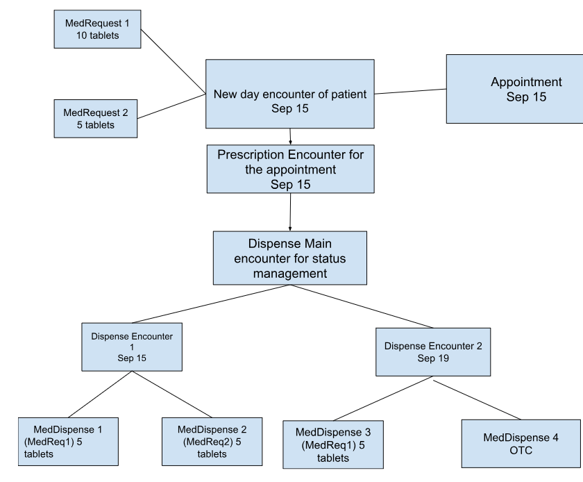

## Medication dispense

The medication dispense allows medicines records to be maintained by pharmacy.

Following is the API workflow for it



### API structure

- **POST /sync/MedicationDispense**
```json
[
    {
        "prescriptionFhirId": "3920",
        "patientId": "3914",
        "generatedOn": "2024-12-04T17:51:00+05:30",
        "status": "fully-dispensed",
        "note": "Please go for a walk",
        "dispenseId": "11cd9233-9695-487b-8023-016969728e9c",
        "appointmentId": "3918",
        "medicineDispensedList": [
            {
                "medReqFhirId": "3921",
                "medDispenseUuid": "114acf3c-287e-4bd1-843d-618fd588a705",
                "qtyDispensed": 10,
                "category": "prescribed",
                "medNote": null,
                "isModified": false,
                "medFhirId": "2174",
                "modificationType": null
            }
        ]
    },
    {
        "prescriptionFhirId": "3922",
        "patientId": "3914",
        "generatedOn": "2024-12-04T17:51:00+05:30",
        "status": "partially-dispensed",
        "note": null,
        "dispenseId": "22cd9233-9695-487b-8023-016969728e9c",
        "appointmentId": "3918",
        "medicineDispensedList": [
            {
                "medReqFhirId": "3923",
                "medDispenseUuid": "224acf3c-287e-4bd1-843d-618fd588a705",
                "qtyDispensed": 4,
                "category": "prescribed",
                "medNote": null,
                "isModified": false,
                "medFhirId": "2172",
                "modificationType": null
            }
        ]
    },
    {
        "patientId": "3914",
        "generatedOn": "2024-12-04T17:51:00+05:30",
        "dispenseId": "248798aa-e1a7-42bf-a74e-f1ef9a7dc3d1",
        "medicineDispensedList": [
            {
                "medDispenseUuid": "1124bb32-7d95-43fd-bf23-78191f3261db",
                "qtyDispensed": 2,
                "category": "OTC",
                "medNote": null,
                "isModified": false,
                "medFhirId": "2170",
                "modificationType": null
            }
        ]
    }
]
```

- **Response**

```json
{
    "status": 1,
    "message": "Data saved successfully.",
    "data": [
        {
            "status": "201 Created",
            "id": "11cd9233-9695-487b-8023-016969728e9c",
            "medicineDispensedList": [
                {
                    "medDispenseUuid": "114acf3c-287e-4bd1-843d-618fd588a705",
                    "medDispenseFhirId": "3943"
                }
            ],
            "err": null,
            "fhirId": "3942"
        },
        {
            "status": "201 Created",
            "id": "22cd9233-9695-487b-8023-016969728e9c",
            "medicineDispensedList": [
                {
                    "medDispenseUuid": "224acf3c-287e-4bd1-843d-618fd588a705",
                    "medDispenseFhirId": "3945"
                }
            ],
            "err": null,
            "fhirId": "3944"
        },
        {
            "status": "200 OK",
            "id": "248798aa-e1a7-42bf-a74e-f1ef9a7dc3d1",
            "medicineDispensedList": [
                {
                    "medDispenseUuid": "1124bb32-7d95-43fd-bf23-78191f3261db",
                    "medDispenseFhirId": "3946"
                }
            ],
            "err": null,
            "fhirId": "3885"
        }
    ]
}
```


- **GET /MedicationDispense?patientId=3914&_count=2000**

```json
{
    "status": 1,
    "message": "Data fetched",
    "total": 2,
    "data": [
        {
            "patientId": "3914",
            "status": "partially-dispensed",
            "prescriptionFhirId": "3922",
            "dispenseData": [
                {
                    "dispenseId": "22cd9233-9695-487b-8023-016969728e9c",
                    "dispenseFhirId": "3944",
                    "patientId": "3914",
                    "generatedOn": "2024-12-04T17:51:00+05:30",
                    "type": "dispensing-encounter",
                    "appointmentId": "3918",
                    "medicineDispensedList": [
                        {
                            "medDispenseFhirId": "3945",
                            "medDispenseUuid": "224acf3c-287e-4bd1-843d-618fd588a705",
                            "patientId": "3914",
                            "qtyDispensed": 4,
                            "medFhirId": "2172",
                            "medReqFhirId": "3923",
                            "date": "2024-12-04T17:51:00+05:30",
                            "category": "prescribed",
                            "isModified": false,
                            "medNote": null,
                            "prescriptionData": {
                                "medReqFhirId": "3923",
                                "medReqUuid": "bb4b756a-80f5-46f7-8da0-cb0bb69ab93a",
                                "medFhirId": "2172",
                                "note": "Please take this medicine at night after food patient",
                                "qtyPerDose": 2,
                                "frequency": 1,
                                "doseForm": "Tablet",
                                "doseFormCode": "421026006",
                                "duration": 5,
                                "timing": "1521000175104",
                                "qtyPrescribed": 10,
                                "prescribedMedication": {
                                    "medFhirId": "2172",
                                    "medCode": "783072003",
                                    "medName": "Cefalexin 500 mg tablet",
                                    "isOTC": false,
                                    "doseForm": "Tablet",
                                    "doseFormCode": "421026006",
                                    "activeIngredient": "cefalexin",
                                    "activeIngredientCode": "387304003",
                                    "medUnit": "mg",
                                    "medNumeratorVal": 500,
                                    "strength": [
                                        {
                                            "medName": "cefalexin",
                                            "unitMeasureValue": 500,
                                            "medMeasureCode": "mg"
                                        }
                                    ]
                                }
                            },
                            "dispensedMedication": {
                                "medFhirId": "2172",
                                "medCode": "783072003",
                                "medName": "Cefalexin 500 mg tablet",
                                "isOTC": false,
                                "doseForm": "Tablet",
                                "doseFormCode": "421026006",
                                "activeIngredient": "cefalexin",
                                "activeIngredientCode": "387304003",
                                "medUnit": "mg",
                                "medNumeratorVal": 500,
                                "strength": [
                                    {
                                        "medName": "cefalexin",
                                        "unitMeasureValue": 500,
                                        "medMeasureCode": "mg"
                                    }
                                ]
                            }
                        }
                    ]
                }
            ]
        },
        {
            "patientId": "3914",
            "status": "fully-dispensed",
            "prescriptionFhirId": "3920",
            "dispenseData": [
                {
                    "dispenseId": "11cd9233-9695-487b-8023-016969728e9c",
                    "dispenseFhirId": "3942",
                    "patientId": "3914",
                    "generatedOn": "2024-12-04T17:51:00+05:30",
                    "type": "dispensing-encounter",
                    "note": "Please go for a walk",
                    "appointmentId": "3918",
                    "medicineDispensedList": [
                        {
                            "medDispenseFhirId": "3943",
                            "medDispenseUuid": "114acf3c-287e-4bd1-843d-618fd588a705",
                            "patientId": "3914",
                            "qtyDispensed": 10,
                            "medFhirId": "2174",
                            "medReqFhirId": "3921",
                            "date": "2024-12-04T17:51:00+05:30",
                            "category": "prescribed",
                            "isModified": false,
                            "medNote": null,
                            "prescriptionData": {
                                "medReqFhirId": "3921",
                                "medReqUuid": "cc4b756a-80f5-46f7-8da0-cb0bb69ab93a",
                                "medFhirId": "2174",
                                "note": "Please take this medicine at night after food patient",
                                "qtyPerDose": 2,
                                "frequency": 1,
                                "doseForm": "Tablet",
                                "doseFormCode": "421026006",
                                "duration": 5,
                                "timing": "1521000175104",
                                "qtyPrescribed": 10,
                                "prescribedMedication": {
                                    "medFhirId": "2174",
                                    "medCode": "324559003",
                                    "medName": "Nitrofurantoin 100 mg tablet",
                                    "isOTC": false,
                                    "doseForm": "Tablet",
                                    "doseFormCode": "421026006",
                                    "activeIngredient": "nitrofurantoin",
                                    "activeIngredientCode": "373543005",
                                    "medUnit": "mg",
                                    "medNumeratorVal": 100,
                                    "strength": [
                                        {
                                            "medName": "nitrofurantoin",
                                            "unitMeasureValue": 100,
                                            "medMeasureCode": "mg"
                                        }
                                    ]
                                }
                            },
                            "dispensedMedication": {
                                "medFhirId": "2174",
                                "medCode": "324559003",
                                "medName": "Nitrofurantoin 100 mg tablet",
                                "isOTC": false,
                                "doseForm": "Tablet",
                                "doseFormCode": "421026006",
                                "activeIngredient": "nitrofurantoin",
                                "activeIngredientCode": "373543005",
                                "medUnit": "mg",
                                "medNumeratorVal": 100,
                                "strength": [
                                    {
                                        "medName": "nitrofurantoin",
                                        "unitMeasureValue": 100,
                                        "medMeasureCode": "mg"
                                    }
                                ]
                            }
                        }
                    ]
                }
            ]
        }
    ]
}
```

## Dispense log for OTC

- **GET DispenseLog?patientId=391**

```json
{
    "status": 1,
    "message": "Data fetched",
    "total": 5,
    "data": [
        {
            "dispenseId": "8d165306-3edb-467e-8dbd-88ed007ef466",
            "dispenseFhirId": "288",
            "patientId": "252",
            "generatedOn": "2024-10-18T23:51:00+05:30",
            "type": "dispensing-encounter",
            "note": "Please go for a walk prescribed 260 2nd time",
            "medicineDispensedList": [
                {
                    "medDispenseFhirId": "289",
                    "medDispenseUuid": "9bb18b1e-eced-4432-a2b5-6a460d27ea12",
                    "patientId": "252",
                    "qtyDispensed": 5,
                    "medFhirId": "44",
                    "medReqFhirId": "263",
                    "date": "2024-10-18T23:51:00+05:30",
                    "category": "prescribed",
                    "isModified": true,
                    "modificationType": "FP",
                    "medNote": "med note check for modification",
                    "prescriptionData": {
                        "medReqFhirId": "263",
                        "medFhirId": "45",
                        "note": "Please take this medicine at night after food patient 252",
                        "qtyPerDose": 2,
                        "frequency": 1,
                        "doseForm": "Tablet",
                        "doseFormCode": "421026006",
                        "duration": 5,
                        "timing": "1521000175104",
                        "qtyPrescribed": 10,
                        "prescribedMedication": {
                            "medFhirId": "45",
                            "medCode": "1148454002",
                            "medName": "Cefalexin 250 mg tablet",
                            "doseForm": "Tablet",
                            "doseFormCode": "421026006",
                            "activeIngredient": "cefalexin",
                            "activeIngredientCode": "387304003",
                            "medUnit": "mg",
                            "medNumeratorVal": 250,
                            "strength": [
                                {
                                    "medName": "cefalexin",
                                    "unitMeasureValue": 250,
                                    "medMeasureCode": "mg"
                                }
                            ]
                        }
                    },
                    "dispensedMedication": {
                        "medFhirId": "44",
                        "medCode": "1148452003",
                        "medName": "Cefalexin 250 mg capsule",
                        "doseForm": "Capsule",
                        "doseFormCode": "420692007",
                        "activeIngredient": "cefalexin",
                        "activeIngredientCode": "387304003",
                        "medUnit": "mg",
                        "medNumeratorVal": 250,
                        "strength": [
                            {
                                "medName": "cefalexin",
                                "unitMeasureValue": 250,
                                "medMeasureCode": "mg"
                            }
                        ]
                    }
                }
            ]
        },
        {
            "dispenseId": "267565af-a0d6-4d8f-9509-2d8552e3704b",
            "dispenseFhirId": "279",
            "patientId": "252",
            "generatedOn": "2024-10-17T23:51:00+05:30",
            "type": "dispensing-encounter",
            "note": "Please go for a walk prescribed 260",
            "medicineDispensedList": [
                {
                    "medDispenseFhirId": "280",
                    "medDispenseUuid": "390f09d7-e62d-4133-b93b-ab13eb324b8f",
                    "patientId": "252",
                    "qtyDispensed": 5,
                    "medFhirId": "45",
                    "medReqFhirId": "263",
                    "date": "2024-10-17T23:51:00+05:30",
                    "category": "prescribed",
                    "isModified": false,
                    "medNote": null,
                    "prescriptionData": {
                        "medReqFhirId": "263",
                        "medFhirId": "45",
                        "note": "Please take this medicine at night after food patient 252",
                        "qtyPerDose": 2,
                        "frequency": 1,
                        "doseForm": "Tablet",
                        "doseFormCode": "421026006",
                        "duration": 5,
                        "timing": "1521000175104",
                        "qtyPrescribed": 10,
                        "prescribedMedication": {
                            "medFhirId": "45",
                            "medCode": "1148454002",
                            "medName": "Cefalexin 250 mg tablet",
                            "doseForm": "Tablet",
                            "doseFormCode": "421026006",
                            "activeIngredient": "cefalexin",
                            "activeIngredientCode": "387304003",
                            "medUnit": "mg",
                            "medNumeratorVal": 250,
                            "strength": [
                                {
                                    "medName": "cefalexin",
                                    "unitMeasureValue": 250,
                                    "medMeasureCode": "mg"
                                }
                            ]
                        }
                    },
                    "dispensedMedication": {
                        "medFhirId": "45",
                        "medCode": "1148454002",
                        "medName": "Cefalexin 250 mg tablet",
                        "doseForm": "Tablet",
                        "doseFormCode": "421026006",
                        "activeIngredient": "cefalexin",
                        "activeIngredientCode": "387304003",
                        "medUnit": "mg",
                        "medNumeratorVal": 250,
                        "strength": [
                            {
                                "medName": "cefalexin",
                                "unitMeasureValue": 250,
                                "medMeasureCode": "mg"
                            }
                        ]
                    }
                },
                {
                    "medDispenseFhirId": "281",
                    "medDispenseUuid": "3087cae1-aa46-4b16-9174-df7cac6afef4",
                    "patientId": "252",
                    "qtyDispensed": 10,
                    "medFhirId": "64",
                    "medReqFhirId": "264",
                    "date": "2024-10-17T23:51:00+05:30",
                    "category": "prescribed",
                    "isModified": false,
                    "medNote": null,
                    "prescriptionData": {
                        "medReqFhirId": "264",
                        "medFhirId": "64",
                        "note": "Please take this medicine at night after food patient 252",
                        "qtyPerDose": 2,
                        "frequency": 1,
                        "doseForm": "Tablet",
                        "doseFormCode": "421026006",
                        "duration": 5,
                        "timing": "1521000175104",
                        "qtyPrescribed": 10,
                        "prescribedMedication": {
                            "medFhirId": "64",
                            "medCode": "765721008",
                            "medName": "Gliclazide 30 mg prolonged-release tablet",
                            "doseForm": "Tablet",
                            "doseFormCode": "421026006",
                            "activeIngredient": "gliclazide",
                            "activeIngredientCode": "395731001",
                            "medUnit": "mg",
                            "medNumeratorVal": 30,
                            "strength": [
                                {
                                    "medName": "gliclazide",
                                    "unitMeasureValue": 30,
                                    "medMeasureCode": "mg"
                                }
                            ]
                        }
                    },
                    "dispensedMedication": {
                        "medFhirId": "64",
                        "medCode": "765721008",
                        "medName": "Gliclazide 30 mg prolonged-release tablet",
                        "doseForm": "Tablet",
                        "doseFormCode": "421026006",
                        "activeIngredient": "gliclazide",
                        "activeIngredientCode": "395731001",
                        "medUnit": "mg",
                        "medNumeratorVal": 30,
                        "strength": [
                            {
                                "medName": "gliclazide",
                                "unitMeasureValue": 30,
                                "medMeasureCode": "mg"
                            }
                        ]
                    }
                }
            ]
        },
        {
            "dispenseId": "597ceb55-cb8e-467a-a386-892efd73c213",
            "dispenseFhirId": "282",
            "patientId": "252",
            "generatedOn": "2024-10-17T23:51:00+05:30",
            "type": "dispensing-encounter",
            "note": "Please go for a walk OTC test",
            "medicineDispensedList": [
                {
                    "medDispenseFhirId": "283",
                    "medDispenseUuid": "a2af44fd-afed-44b9-82c7-b728e72b144b",
                    "patientId": "252",
                    "qtyDispensed": 10,
                    "medFhirId": "65",
                    "date": "2024-10-17T23:51:00+05:30",
                    "category": "OTC",
                    "isModified": false,
                    "medNote": "OTC ADDED PLEASE CHECK",
                    "prescriptionData": {},
                    "dispensedMedication": {
                        "medFhirId": "65",
                        "medCode": "1193811004",
                        "medName": "Gliclazide 60 mg prolonged-release tablet",
                        "doseForm": "Tablet",
                        "doseFormCode": "421026006",
                        "activeIngredient": "gliclazide",
                        "activeIngredientCode": "395731001",
                        "medUnit": "mg",
                        "medNumeratorVal": 60,
                        "strength": [
                            {
                                "medName": "gliclazide",
                                "unitMeasureValue": 60,
                                "medMeasureCode": "mg"
                            }
                        ]
                    }
                }
            ]
        },
        {
            "dispenseId": "a9d18090-9db0-48bc-957d-23a97ac89b69",
            "dispenseFhirId": "284",
            "patientId": "254",
            "generatedOn": "2024-10-17T23:51:00+05:30",
            "type": "dispensing-encounter",
            "note": "Please go for a walk prescribed 262",
            "medicineDispensedList": [
                {
                    "medDispenseFhirId": "285",
                    "medDispenseUuid": "98133886-9c28-4efd-8a68-ce47a25110fb",
                    "patientId": "254",
                    "qtyDispensed": 10,
                    "medFhirId": "45",
                    "medReqFhirId": "265",
                    "date": "2024-10-17T23:51:00+05:30",
                    "category": "prescribed",
                    "isModified": false,
                    "medNote": null,
                    "prescriptionData": {
                        "medReqFhirId": "265",
                        "medFhirId": "45",
                        "note": "Please take this medicine at night after food patient 254",
                        "qtyPerDose": 2,
                        "frequency": 1,
                        "doseForm": "Tablet",
                        "doseFormCode": "421026006",
                        "duration": 5,
                        "timing": "1521000175104",
                        "qtyPrescribed": 10,
                        "prescribedMedication": {
                            "medFhirId": "45",
                            "medCode": "1148454002",
                            "medName": "Cefalexin 250 mg tablet",
                            "doseForm": "Tablet",
                            "doseFormCode": "421026006",
                            "activeIngredient": "cefalexin",
                            "activeIngredientCode": "387304003",
                            "medUnit": "mg",
                            "medNumeratorVal": 250,
                            "strength": [
                                {
                                    "medName": "cefalexin",
                                    "unitMeasureValue": 250,
                                    "medMeasureCode": "mg"
                                }
                            ]
                        }
                    },
                    "dispensedMedication": {
                        "medFhirId": "45",
                        "medCode": "1148454002",
                        "medName": "Cefalexin 250 mg tablet",
                        "doseForm": "Tablet",
                        "doseFormCode": "421026006",
                        "activeIngredient": "cefalexin",
                        "activeIngredientCode": "387304003",
                        "medUnit": "mg",
                        "medNumeratorVal": 250,
                        "strength": [
                            {
                                "medName": "cefalexin",
                                "unitMeasureValue": 250,
                                "medMeasureCode": "mg"
                            }
                        ]
                    }
                }
            ]
        },
        {
            "dispenseId": "971c516b-a9cd-4622-85bd-bc186f18df2c",
            "dispenseFhirId": "286",
            "patientId": "254",
            "generatedOn": "2024-10-17T23:51:00+05:30",
            "type": "dispensing-encounter",
            "note": "Please go for a walk OTC test",
            "medicineDispensedList": [
                {
                    "medDispenseFhirId": "287",
                    "medDispenseUuid": "74cf4442-150f-4598-aab3-c22b689275c7",
                    "patientId": "254",
                    "qtyDispensed": 10,
                    "medFhirId": "64",
                    "date": "2024-10-17T23:51:00+05:30",
                    "category": "OTC",
                    "isModified": false,
                    "medNote": "OTC ADDED PLEASE CHECK",
                    "prescriptionData": {},
                    "dispensedMedication": {
                        "medFhirId": "64",
                        "medCode": "765721008",
                        "medName": "Gliclazide 30 mg prolonged-release tablet",
                        "doseForm": "Tablet",
                        "doseFormCode": "421026006",
                        "activeIngredient": "gliclazide",
                        "activeIngredientCode": "395731001",
                        "medUnit": "mg",
                        "medNumeratorVal": 30,
                        "strength": [
                            {
                                "medName": "gliclazide",
                                "unitMeasureValue": 30,
                                "medMeasureCode": "mg"
                            }
                        ]
                    }
                }
            ]
        }
    ]
}
```
