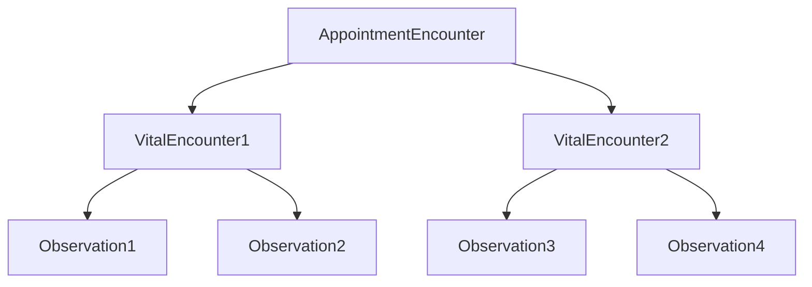

## Description
This section covers the flow of vitals section

## Mockup
[Link](https://www.figma.com/proto/hTICk8z7Nd3nP0SxVlCWb8/FHIR-for-school?page-id=57795%3A469&node-id=57849-28064&node-type=frame&viewport=312%2C-671%2C0.92&t=WBJshOSqYTAPWREG-1&scaling=scale-down&content-scaling=fixed&starting-point-node-id=57795%3A6473&show-proto-sidebar=1)

### Add Vitals
1. Every vital detail will have a separate Observation resource. We need to link it to the Encounter resource.
2. Create an encounter resource to link all the observation resources. This encounter resource acts as a binding resource to all observation resources created at that time.
3. Every time a new vital entry is made a new encounter resource will be created.
4. Link the appointment encounter of the day to this encounter.

### Resources
**1. Encounter Resource**
- [Resource link](/fhir-resources/vitals-encounter.md)

**2. Observation resource**
- [Resource link](/fhir-resources/observation.md)