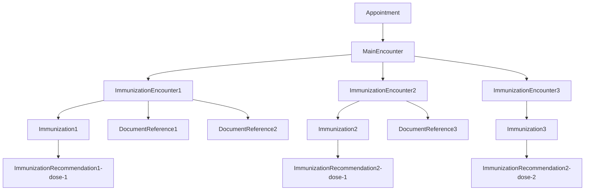

# Immunization

## Description
Immunization or vaccination API captures the details of the patients and the vaccines administered to them. It is split into 2 APIs:
1. MedicationRequest - To fill prescription form
2. PrescriptionFile - To upload document 
They both will work independent of each other, but linked through same appointment id.
3. Every new prescriptionUUID will have a prescriptionEncounter. The structure followed is below:

## FHIR Resources
1. [Immunization Encounter resource ](/fhir-resources/ImmunizationEncounter.md)
2. [Immunization resource](/fhir-resources/immunization.md)
3. [Document reference](/fhir-resources/DocumentReference-Immunization.md)

## Flow diagram of vaccination module



## APIs
Immunization will be broken down into 5 APIs
1. Fetch organizations list as vaccine manufacturers
- API `GET` `//vaccine/manufacturer`
```json
    {
    "status": 1,
    "message": "Data fetched",
    "total": 2,
    "data": [
        {
            "manufacturerId": "22344",
            "manufacturerName": "Bharat biotech International Ltd",
            "orgType": "bus",
            "active": true,
        },
        {
            "manufacturerId": "22345",
            "manufacturerName": "Biological E.",
            "orgType": "bus",
            "active": true,
        }
    ]
}
```

2. Sync(Save) vaccination detail of multiple patient 
- API `POST` `//Immunization`
- **Request**
```json
[
    {
        "appointmentId" : "6648",
        "immunizationUuid": "47fa17e9-b94b-4fa6-b10c-3c90741ca398",
        "patientId": "6642",
        "createdOn" : "2025-03-06",
        "lotNumber": "VX-2024-0001",
        "expiryDate" : "2025-10-05T04:32:20.227+00:00",
        "manufacturerId": "6565",
        "notes" : "Headache, fever",
        "vaccineCode": "19",
        "immunizationFiles": [{
            "filename": "example.jpg"
        }
        ]
    },
    {
        "appointmentId" : "6648",
        "immunizationUuid": "8532ab1f-a169-4746-b57b-783e11f3e88b",
        "patientId": "6642",
        "createdOn" : "2025-03-06",
        "lotNumber": "VX-2024-0002",
        "expiryDate" : "2025-10-05T04:32:20.227+00:00",
        "manufacturerId": null,
        "notes" : null,
        "vaccineCode": "45",
        "immunizationFiles": []
    },
     {
        "appointmentId" : "6650",
        "immunizationUuid": "09eb1f42-2dcb-4704-aeb7-ba809b41eb49",
        "patientId": "6644",
        "createdOn" : "2025-03-06",
        "lotNumber": "VX-2024-0003",
        "expiryDate" : "2025-10-05T04:32:20.227+00:00",
        "manufacturerId": "6565",
        "notes" : "Headache, fever",
        "vaccineCode": "2",
        "immunizationFiles": [{
            "filename": "Screenshot from 2025-02-21 10-17-14.png"
        }
        ]
    },
    {
        "appointmentId" : "6650",
        "immunizationUuid": "f68c9778-3fbd-4775-ac18-e63b1067d3a7",
        "patientId": "6644",
        "createdOn" : "2025-03-06",
        "lotNumber": "VX-2024-0004",
        "expiryDate" : "2025-10-05T04:32:20.227+00:00",
        "manufacturerId": null,
        "notes" : null,
        "vaccineCode": "10",
        "immunizationFiles": []
    }
]
```
- **Response**
#### Response Body : 
```json
{
    "status": 1,
    "message": "Data saved successfully.",
    "data": [
        {
            "status": "201 Created",
            "id": "47fa17e9-b94b-4fa6-b10c-3c90741ca398",
            "err": null,
            "fhirId": "6653"
        },
        {
            "status": "201 Created",
            "id": "8532ab1f-a169-4746-b57b-783e11f3e88b",
            "err": null,
            "fhirId": "6656"
        },
        {
            "status": "201 Created",
            "id": "09eb1f42-2dcb-4704-aeb7-ba809b41eb49",
            "err": null,
            "fhirId": "6658"
        },
        {
            "status": "201 Created",
            "id": "f68c9778-3fbd-4775-ac18-e63b1067d3a7",
            "err": null,
            "fhirId": "6661"
        }
    ]
}
```
4. Fetch vaccination details of the patients.
- API `GET` `//Immunization`
- Parameter - patientId=id1,id2
- Example - `/Immunization?patientId=6642,6644&_count=5000`
- **Request**
```json
{
    "status": 1,
    "message": "Data fetched",
    "total": 4,
    "data": [
        {
            "immunizationUuid": "8532ab1f-a169-4746-b57b-783e11f3e88b",
            "immunizationId": "6656",
            "vaccineCode": "45",
            "notes": null,
            "lotNumber": "VX-2024-0002",
            "manufacturerId": null,
            "expiryDate": "2025-10-05T04:32:20.227+00:00",
            "createdOn": "2025-03-06",
            "patientId": "6642",
            "immunizationFiles": []
        },
        {
            "immunizationUuid": "47fa17e9-b94b-4fa6-b10c-3c90741ca398",
            "immunizationId": "6653",
            "vaccineCode": "19",
            "notes": "Headache, fever",
            "lotNumber": "VX-2024-0001",
            "manufacturerId": "6565",
            "expiryDate": "2025-10-05T04:32:20.227+00:00",
            "createdOn": "2025-03-06",
            "patientId": "6642",
            "immunizationFiles": [
                {
                    "filename": "example.jpg"
                }
            ]
        },
        {
            "immunizationUuid": "09eb1f42-2dcb-4704-aeb7-ba809b41eb49",
            "immunizationId": "6658",
            "vaccineCode": "2",
            "notes": "Headache, fever",
            "lotNumber": "VX-2024-0003",
            "manufacturerId": "6565",
            "expiryDate": "2025-10-05T04:32:20.227+00:00",
            "createdOn": "2025-03-06",
            "patientId": "6644",
            "immunizationFiles": [
                {
                    "filename": "Screenshot from 2025-02-21 10-17-14.png"
                }
            ]
        },
        {
            "immunizationUuid": "f68c9778-3fbd-4775-ac18-e63b1067d3a7",
            "immunizationId": "6661",
            "vaccineCode": "10",
            "notes": null,
            "lotNumber": "VX-2024-0004",
            "manufacturerId": null,
            "expiryDate": "2025-10-05T04:32:20.227+00:00",
            "createdOn": "2025-03-06",
            "patientId": "6644",
            "immunizationFiles": []
        }
    ]
}
```
