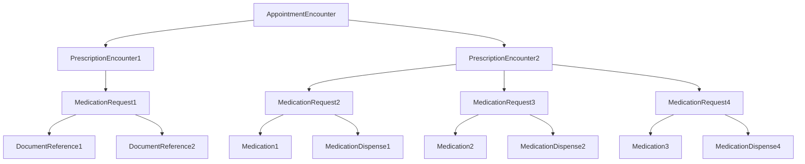

# Prescription

## Description
Each prescription is broken down into 2 APIs:
1. `MedicationRequest` - To fill prescription form
2. `PrescriptionFile` - To upload document 
They work independently of each other, but are linked through same appointment id.
3. Every new prescriptionUUID has a prescriptionEncounter. The structure followed is below:



## FHIR Resources

### Prescription Encounter
```json
{
        "resourceType": "Encounter",
        "identifier": [
          {
            "system": "http://hl7.org/fhir/sid/sn",
            "value": "9a150ba5-db20-4b2b-a81a-e90d4bc06884" // Prescription uuid
          }
        ],
        "status": "finished",   //  the status can be changed to 
        "type": [
          {
            "coding": [
              {
                "system": "http://www.thelattice.org/encounter-type",
                "code": "prescription-encounter",
                "display": "Prescription encounter"
              }
            ]
          }
        ],
        "subject": {
          "reference": "Patient/254"
        },
        "period": {
          "start": "2024-09-30T17:35:00+05:30",
          "end": "2024-09-30T17:35:00+05:30"
        },
        "partOf": {
          "reference": "Encounter/269"  // links to appointment encounter
        }
}
```

### MedicationRequest for form-based input
[Resource Link](/fhir-resources/medication-request.md)

### MedicationRequest for document upload
[Resource Link](/fhir-resources/medication-request-photo-upload.md)

### DocumentReference
[Resource Link](/fhir-resources/document-reference.md)

## API name and structure for facade
- POST (form)  MedicationRequest
```json
[
  {
    "appointmentId": "115",
    "patientId": "108",
    "generatedOn": "2024-10-08T17:00:00+05:30",
    "prescriptionId": "7c270e0e-1ccf-417b-9765-cbe53f85ef80",
    "prescription": [
      {
        "medFhirId": "137",
        "medReqUuid": "c7ceb34e-27e7-4ded-a324-c6e093311a14",
        "qtyPerDose": 2,
        "frequency": 1,
        "doseForm": "Tablet",
        "timing": "1521000175104",
        "duration": 5,
        "qtyPrescribed": 10,
        "note": "Please take this medicine at night after food patient 108",
        "medReqUuid": "d71a9b13-58fa-4c6e-bbea-f34d6abb23d1"
      },
      {
        "medFhirId": "126",
        "qtyPerDose": 2,
        "frequency": 1,
        "doseForm": "Tablet",
        "timing": "1521000175104",
        "duration": 5,
        "qtyPrescribed": 10,
        "note": "Please take this medicine at night after food patient 115",
        "medReqUuid": "1d12078c-4264-4d4e-963a-794456519a85"
      }
    ]
  }
]
```

### response
```json
{
    "status": 1,
    "message": "Data saved successfully.",
    "data": [
        {
            "status": "201 Created",
            "id": "77d7115a-82cd-428e-9dc7-ff624476fe62",
            "prescription": [
                {
                    "medReqUuid": "gg4b756a-80f5-46f7-8da0-cb0bb69ab93a",
                    "medReqFhirId": "3630"
                }
            ],
            "err": null,
            "fhirId": "3629"
        }
    ]
}
```
### API POST PrescriptionFile

```json
- POST (file)  PrescriptionFile

[
  {
    "appointmentId": "115",
    "patientId": "108",
    "generatedOn": "2024-10-08T17:00:00+05:30",
    "prescriptionId": "9sds70e0e-1ccf-417b-9765-cbe53f85ef80",
    "prescriptionFiles": [
            {
                "filename"  : "342343242.jpeg",
                "note": "this is note 1"
            },
            {
                "filename"  : "342343242.jpeg",
                "note": "" //send empty string in request body when no note
            }
        ]
  }
]
```
Impact on existing code
1. Post medReq
New encounter create
