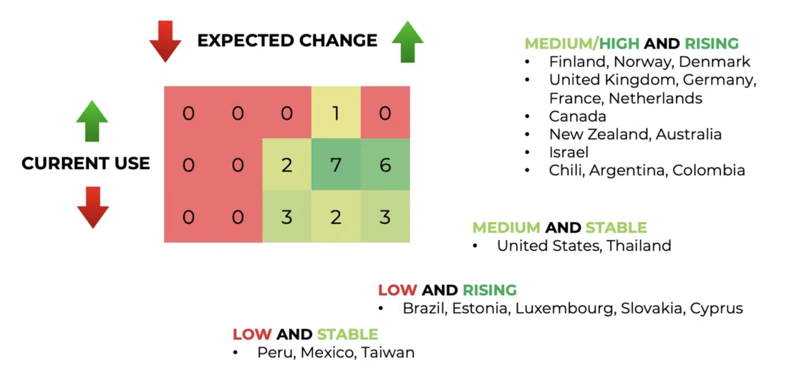

# FHIR data model

FHIR has seen widespread adoption globally, particularly in high-income nations, as illustrated below[^1]. Public institutions such as the US Federal government are advocating for FHIR as a means to bring greater transparency and accountability to healthcare systems.

While tertiary care hospitals and large insurers have moved to FHIR, its use in public health settings is still limited. In designing Agni, we have carefully selected and connected those elements of FHIR that are optimal for public health services — while conforming to the overall structure recommended by this standard.

In particular, we have focused on how populations need to be represented at scale — by supporting integration with unique identifiers, and by enabling members of the same household to be connected. We have avoided tertiary care workflows, to reduce data entry burden on users and keep the system mobile-friendly.

Our systematic use of FHIR provides a well-documented data model. This makes the codebase maintainable, generalizable, and transparent — giving our Clients the autonomy to adapt it to their needs.

[!ref FHIR API documentation](/facade-api-docs/index.md)

[!ref FHIR Resources](/fhir-resources/index.md)

[^1]: Source: [FHIR maturity and adoption](https://fire.ly/blog/fhir-maturity-and-adoption-around-the-world/), Fire.ly blog, last accessed July 1, 2024
