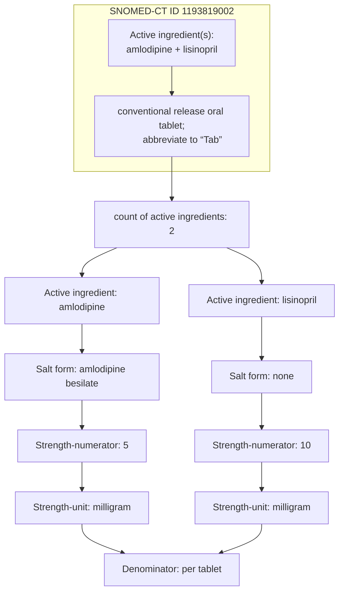

# Ready-to-use pharmacopoeia
We are in the process of incorporating the WHO’s essential medicine list into a FHIR-friendly format; about half has been completed. The dataset does not contain brand names; it only contains formulations.

Given the complexity of pharmacological data, we have taken care to translate drug information into a FHIR structure that fully captures its nuances. This information is available while prescribing, and while dispensing.

Consider a combination drug commonly used to treat hypertension: Amlodipine 5 mg + Lisinopril 10 mg tablet. This drug is deconstructed as follows:

As demonstrated above, each ingredient, and even the salt form, is encoded. Drug strength (by ingredient) and form[^1] are also captured. Since this drug is commonly prescribed, the combination itself has a SNOMED-CT code. If the formulation were more esoteric, we would have coded the individual ingredients, rather than the combination.

This structure also enables us to connect to drug-drug interactions (DDI) and adverse drug reaction (ADR) databases. In case you are aware of DDI and ADR open-source databases with API interfaces, please send a note to info[at]thelattice.in.

[^1]: Form is related to, but different from, route of administration. For example, injections (form) can be administered through intravenous or intramuscular routes. From a medication administration perspective, route is what matters. From a dispensing perspective, form is what matters.
