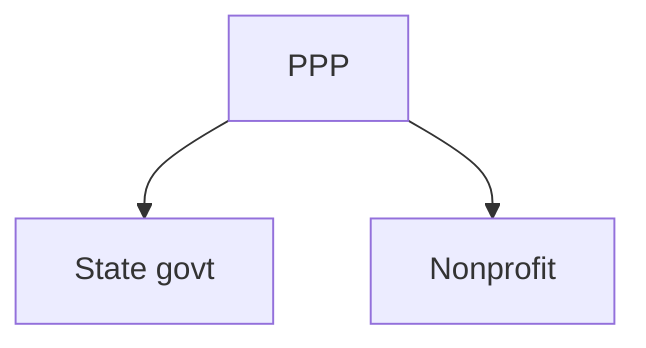

# Organizations
Any organization that deploys Agni needs to be able to create its own identity within the system. By doing so, the organization is able to link its members, such as doctors, nurses, paramedics, pharmacists and administrative staff, to a common entity.

## The FHIR paradigm
FHIR provides the [`Organization`](https://www.hl7.org/fhir/organization.html) resource for this purpose. This resource is used for collections of people that have come together to achieve an objective. In contrast, the `Group` resource is used to identify a collection of people (or animals, devices, etc.) that are gathered for the purpose of analysis or acting upon, but are not expected to act themselves.

The `Organization` resource often exists as a hierarchy, using the `part-of` property to associate the child to its parent organization. Such a hierarchy communicates the conceptual structure of an organization.

In contrast, the `Location` resource provides the physical representation of the hierarchy. Locations are always used for recording where a service occurs, and hence where encounters and observations take place. 

`Organization` and `Location` hierarchies link to one another. All locations do not have to link to the topmost level of the organization. For example, the "Acme Hospital" organization can have a child organization, the "Cardiology department". This organizational unit may be associated with two locations, "Floor 1, Wing B" and "Floor 5, Wing A". Neither location needs to be directly associated with "Acme Hospital".

## Adapting FHIR
In the context of public healthcare delivery, we can visualize the following structure:
1. L1 Organization: Central/ federal government
2. L2 Child-organization: State or provincial government
3. L3 Child-organization: District or municipality within a state/province
4. L4 Child-organization: Hospital or clinic within that municipality
5. L5 Child-organization: A department or ward within a hospital. 

Agni shall stop at four levels, because it only covers primary care clinics where integrated services are delivered — there are no departmental structures. Note that difference roles — such as a Pharmacist versus a Doctor — can still be handled using the `Practitioner` resource. This aspect is addressed in the [Practitioner](Practitioner.md) scope note.

## Organization resource: important elements
The `Organization` resource is quite straightforward; refer to https://www.hl7.org/fhir/organization.html#resource. The only element of note is the one mentioned earlier — the `.partOf` property that establishes parent-child linkages.

It does not contain any address fields. These have to be captured in the [`Location`](https://www.hl7.org/fhir/location.html#Location) resource, which points to the relevant organization unit using the `Location.managingOrganization` property.

## Implications on other functionality
Organizational units shall be able to influence access control policies. Thus, a user associated with L1 (Central government) `Organization` can have difference access privileges than a user associated with an L4 (Clinical) `Organization`. Privileges are not summative by design—an L1 org-user can have an entirely different set of privileges than an L4 org-user.

## Constraints
LatticeOnFHIR shall only provide for a single top-level organization. If there are two or more collaborators who use the system, then they shall be defined as children of a dummy top-level organization. 

For example, consider a public-private partnership (PPP) where some primary care centers are run by a state government, and others are run by a private nonprofit. These organizations will be bound to a single hierarchy, as follows:

